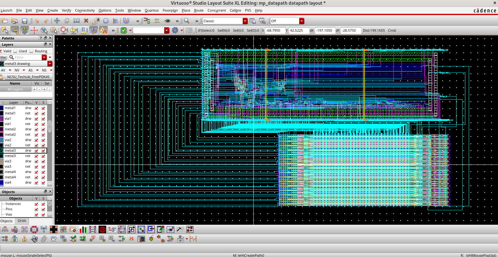
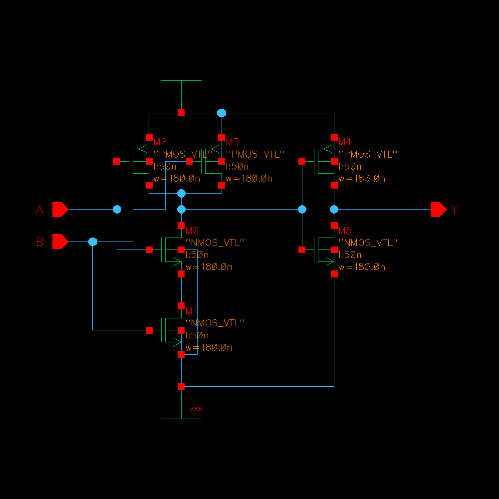
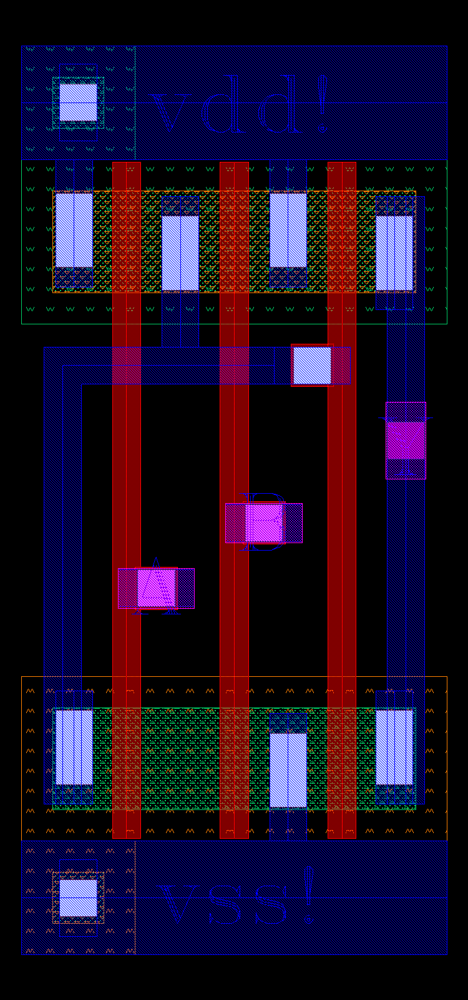
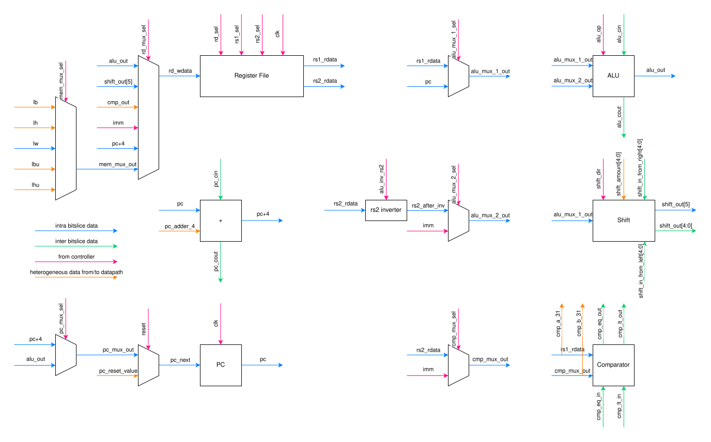
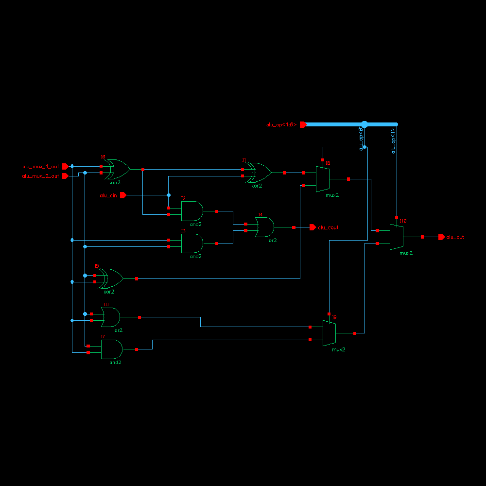
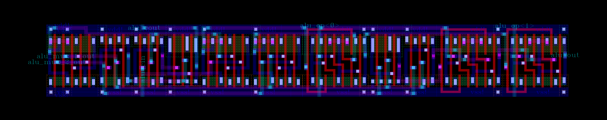
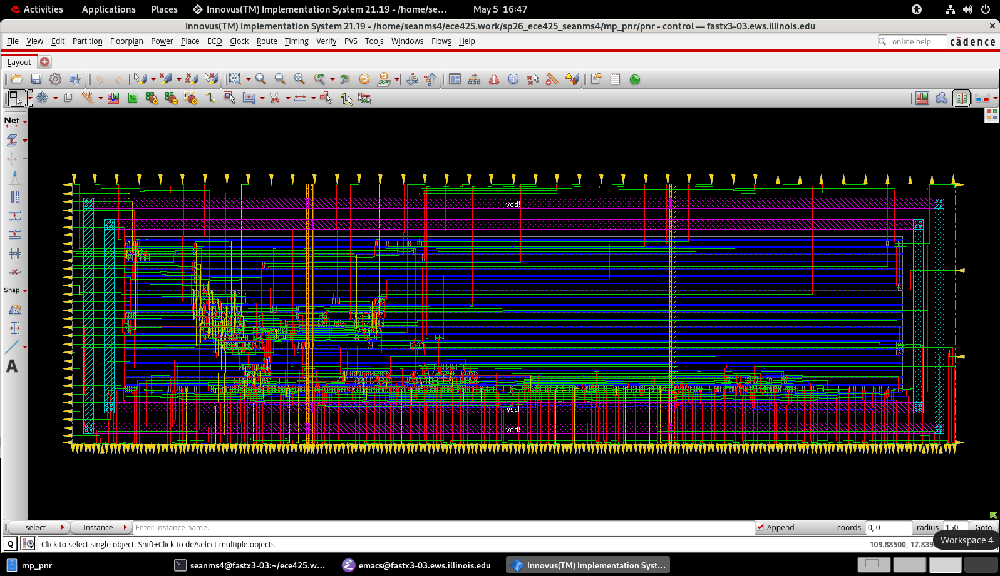
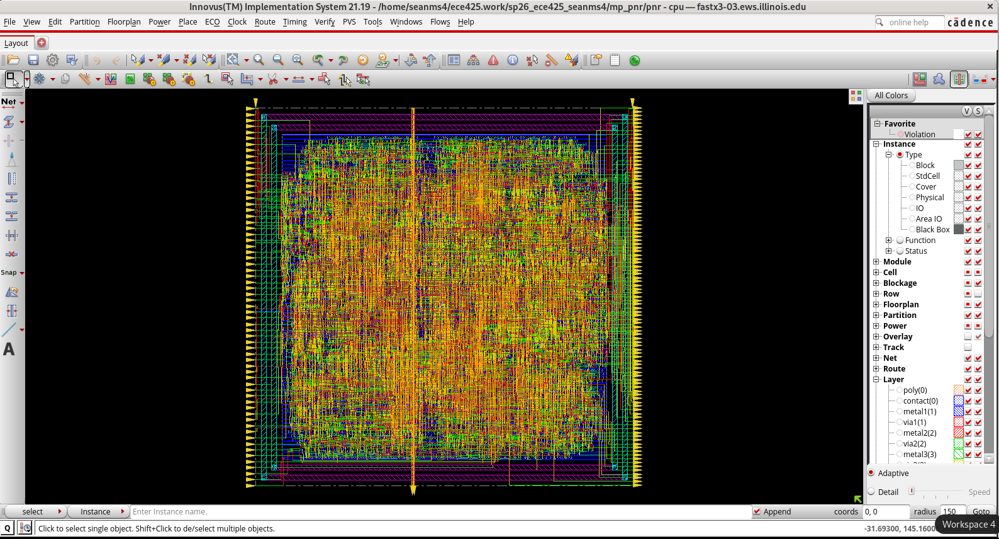
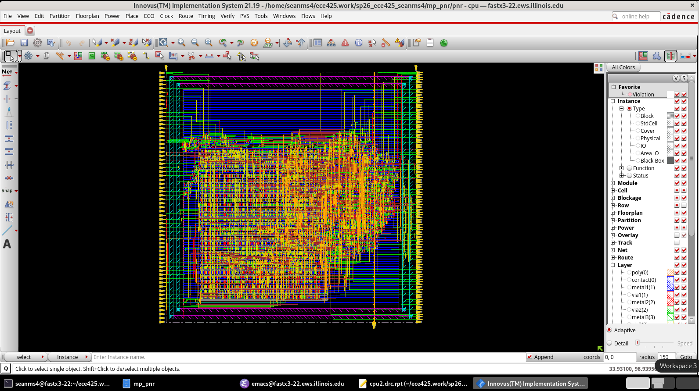

# RISC-V ASIC Physical Design

This project covers the physical design of a 32-bit bit-sliced RISC-V processor. A custom standard-cell library was designed and verified in Cadence Virtuoso, then used to build the ALU, register file, and other logic modules. These blocks were routed together to form a bitslice layout that was instantiated and stacked together 32 times, creating the full datapath. Separately, Cadence Innovus was used to implement the controller and complete alternate CPU layouts through automated place and route.

 
<em>Complete processor with the manually laid-out datapath connected to the placed-and-routed controller.</em>

## Custom Standard Cell Library

To start, a library of thirteen logic cells was designed for FreePDK45. Each cell is based off of a CMOS schematic that was functionally simulated before layout. Transistor sizing accounted for the lower mobility of holes relative to electrons in silicon. PMOS devices were therefore made approximately 2× wider than comparable NMOS devices to achieve similar drive strength, with additional width used in series stacks to compensate for their higher effective resistance. Euler paths guided transistor ordering so adjacent devices could share diffusion, reducing breaks in the active region and keeping the layouts compact.

The cells shared a common height and aligned `VDD` and `VSS` rails so they could form seamless rows when placed horizontally. Each layout passed design-rule checking (DRC) and layout-versus-schematic (LVS) verification, and symbols generated from the verified schematics were used for hierarchical design.

The library contains eleven combinational cells, `INV`, `BUF`, `NAND2`, `NOR2`, `AND2`, `OR2`, `AOI21`, `OAI21`, `XOR2`, `XNOR2`, and `MUX2`, along with the sequential `LATCH` and `DFF` cells.

&nbsp;&nbsp;

 
<em>Representative AND2 cell at the schematic and physical-layout levels.</em>

Liberty timing and LEF physical views were also generated for use in the later Innovus flows.

## Bitslice Architecture

The datapath was divided into identical bitslices, each handling the circuitry associated with one corresponding bit. Matching interfaces allowed the slices to be joined together to form the complete datapath. Shared control signals follow consistent routes through each slice, while connections between adjacent slices are aligned at their boundaries. For example, `cin` and `cout` connect from one slice to the next to form the arithmetic carry chain for the ALU.

 
<em>Course-provided architecture reference for one bit position of the processor datapath.</em>

### Arithmetic Logic Unit

The ALU schematic was built hierarchically from various symbols that were each associated with a standard cell. The completed schematic was functionally simulated by applying input and control combinations and checking that the resulting outputs matched the expected ALU behavior. The ALU was then packaged as its own symbol for use in the higher-level bitslice schematic.

 
<em>One-bit ALU schematic constructed from symbols in the custom cell library.</em>

The ALU layout was assembled by routing together instances of the layouts of the standard cells that were used to construct the schematic. Signals connecting the ALU to logic within the bitslice, such as `alu_mux_1` and `alu_out`, are placed along the left and right edges, while control and carry signals such as `alu_op<1>` and `alu_cin` are exposed at the top and bottom of the layout to enable easy connections with neighboring bitslices.

 
<em>One-bit ALU layout organized for integration into the repeated bitslice.</em>

### Full 32-Bit Datapath

The top-level datapath schematic, composed of 32 bitslice schematics, was netlisted and simulated using a test program. The resulting output was compared with the golden output from the course-provided SystemVerilog reference processor to verify matching behavior.

Similarly, the datapath layout was then constructed by routing together 32 instances of bitslice layouts, which then passed DRC and LVS.

 
<em>Complete datapath formed from repeated instances of the manually laid-out bitslice.</em>

### Automated Place and Route of Controller

The controller decodes instructions and generates the control signals that direct the datapath. Unlike the manually routed datapath, it was implemented through scripted place and route in Cadence Innovus using the synthesized controller netlist and exported views of the custom standard cell library.

 
<em>Processor controller placed and routed in Cadence Innovus.</em>

### Custom Datapath and Controller Integration

The routed controller was imported into Virtuoso and connected to the corresponding control interfaces on the manually laid-out datapath to form the complete processor.

 
<em>Placed-and-routed controller connected to the manually laid-out datapath.</em>

### Automated Place and Route of Full CPU

A separate physical design flow automats the routing of the entire processor directly from the custom standard cell library, without preserving the manually constructed datapath blocks or bitslice layout used earlier. To utilize the old custom standard cells, abstract views were generated in Virtuoso to define pin locations and routing blockages, then exported as a LEF file for Innovus. A Liberty file provided the corresponding logical information used during synthesis.

A course-provided Tcl skeleton was completed by working through Innovus documentation on valid commands. Running the completed script placed and routed the synthesized CPU entirely from instances of the custom standard cells.

 
<em>Complete CPU implemented through the standard-cell place-and-route flow.</em>

### Automated Place and Route of Full CPU with Custom Register File

A second flow reintroduced the register file layout originally developed for the manually routed datapath. The register file was packaged as a physical macro, with its instances fixed in the floorplan while Innovus placed and routed the remaining standard cell logic.

 
<em>Complete CPU with the manually designed register file incorporated as a physical macro.</em>

## Innovus Automation

| Script | Physical Design Target |
| --- | --- |
| [`control.tcl`](scripts/control.tcl) | Place and route of the processor controller |
| [`cpu_standard_cells.tcl`](scripts/cpu_standard_cells.tcl) | Full CPU routed from the standard cell library views |
| [`cpu_custom_regfile.tcl`](scripts/cpu_custom_regfile.tcl) | Full CPU incorporating the custom register file module |

## Scope

This project was completed as part of a university VLSI design course.